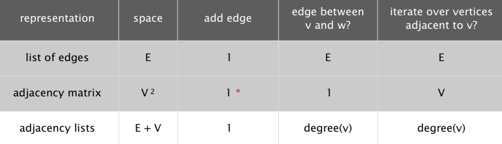

# Undirected Graphs

  - Vertex (aka Node, Point)  
  - Edge (aka Arc, Line) connecting vertices  
  - Path: sequence of vertices connected by edges  
  - Cycle: is path which first vertex is also last vertex  

## How to store a graph

### 1. List of edges  
Maintain a list of edges  

### 2. Adjacent matrix
Maintain a matrix `adj[V][V]`  
For each edge of `v1` and `v2`, `adj[v1][v2] == adj[v2][v1] == true`  

### 3. Adjacent list
Maintain a list `adj[V]`. Item at `adj[v1]` is a list of all adjacent vertices to `v1`  

